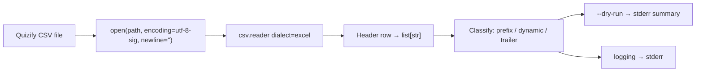

# Phase 1: CSV ingestion & column layout - Research

**Researched:** 2026-05-03  
**Domain:** Python stdlib CSV ingestion, header classification, CLI ergonomics  
**Confidence:** HIGH (CSV behavior verified against Python docs + sample fixture parse)

<user_constraints>
## User Constraints (from CONTEXT.md)

### Locked Decisions

#### Preview / debug UX (Area 1)

- **D-01:** Send **diagnostics and human-readable previews to stderr**; reserve **stdout** for primary machine-readable output when Phase 2 emits JSON (Unix convention: data on stdout, logs/diagnostics on stderr — aligns with common CSV CLI tools).
- **D-02:** **`--dry-run`** prints a **layout summary only**: row count, total columns, counts per group (contact / dynamic / trailer), **ordered list of dynamic header texts**, and derived **question count**. Do **not** print cell values in dry-run or default logging.
- **D-03:** Use **`logging` directed at stderr**; default log level **WARNING**. **`-v` / `--verbose`** raises to **INFO** and may include extra structural detail (e.g. column indices per group) — still **no bulk row content** unless explicitly overridden later with a separate dangerous flag (not in Phase 1 scope).

#### Trailer block detection (Area 2)

- **D-04:** **Default trailer suffix** (ordered, contiguous at end of header row) matches the sample export: `Result logic`, `Score category`, `Score value`, `Answer tags`, `Time to complete (mm:ss)`, `Date`.
- **D-05:** Provide **`--trailer-columns`** as a **comma-separated ordered list** to override the default trailer set when Quizify adds/reorders trailing fields — keeps behavior forward-compatible without code changes.
- **D-06:** **Classification:** columns after the fixed contact prefix and **before** the detected trailer suffix form the **dynamic question block**, in header order; indices map to **`question-1` … `question-K`** in Phase 2 (`K` = dynamic count).

#### Header matching strictness (Area 3)

- **D-07:** Read CSV as **UTF-8** using **`utf-8-sig`** so a leading BOM does not break header equality.
- **D-08:** For **classification keys** (matching known fixed and trailer names), normalize each header with **leading/trailing whitespace strip** and **Unicode NFC** (`unicodedata.normalize("NFC", ...)`) before comparison to canonical strings.
- **D-09:** **Retain the raw header string** from the parser for each column for later emission (`question-N` text must match export text); use normalization **only for equality checks**, not for overwriting stored labels.
- **D-10:** **No case-folding** by default for header matching (preserve Quizify’s casing); if future exports drift only by case, address via a later explicit flag — not Phase 1.

#### CLI entry shape (Area 4)

- **D-11:** Phase 1 uses a **single argparse entrypoint** (one positional input path, global optional flags). **No subcommands** for this phase — keeps the tool minimal until Phase 2 adds JSON emission modes that may share the same parser.
- **D-12:** Flags for Phase 1 at minimum: **`--dry-run`**, **`-v` / `--verbose`**, **`--trailer-columns`**; script lives under **`quizify-csv-to-json-webhook/`** following repo “folder per helper” convention.

### Claude's Discretion

- Exact help strings and whether `-q`/`--quiet` is exposed — minor UX polish during implementation.

### Deferred Ideas (OUT OF SCOPE)

- HTTP POST / webhook send mode (**AUTO-01**, v2) — out of scope for ingestion phase.
- Optional JSON Schema validation (**VALI-01**) — later phase.
- Subcommands (`convert`, `validate`) — defer until Phase 2+ surfaces distinct verbs with incompatible flag sets.
</user_constraints>

<phase_requirements>
## Phase Requirements

| ID | Description | Research Support |
|----|-------------|------------------|
| CONV-01 | The tool accepts an input CSV path (UTF-8) and produces JSON output (single array file or stdout), suitable for piping into webhook receivers or saving for replay. | Phase 1 establishes argparse path handling, `utf-8-sig` reader, and stdout/stderr split; JSON emission deferred to Phase 2 but ingestion path must be solid and pipe-friendly (stderr-only diagnostics). |
| CONV-02 | Fixed columns are distinguished from dynamic quiz question columns using the known export layout (contact fields first, `Result logic` … `Date` trailer block); remaining headers map to `question-N` indices in order. | Implemented via ordered fixed-prefix list + contiguous trailer suffix detection (defaults + `--trailer-columns`); dynamic slice preserves header order for `question-1..K`. |
</phase_requirements>

## Summary

Phase 1 is a **stdlib-first Python CLI** under `quizify-csv-to-json-webhook/` that opens the export with **`encoding="utf-8-sig"`** and **`newline=""`**, reads the header row with **`csv.reader(..., dialect="excel")`** (default), then **classifies columns** without manual indexes: verify the leading **contact prefix** matches canonical names (strip + NFC equality), confirm the **trailing block** matches either defaults or `--trailer-columns`, and treat the middle as **ordered dynamic question columns**. Raw header strings are retained for labels; normalization applies only to comparisons [per CONTEXT D-08/D-09].

**Verified on fixture** [VERIFIED: local parse of `quizify-submissions.csv`]: **32** total columns, **6** fixed prefix, **20** dynamic, **6** trailer; trailer suffix matches defaults; **43** lines total (**42** data rows + header).

**Primary recommendation:** Implement a small `Layout` (or similar) dataclass: `prefix_headers`, `dynamic_headers`, `trailer_headers`, counts, and file row count from a single pass or header-first + row iterator; wire `--dry-run` to stderr-only summary with **no cell values**; use `logging` at WARNING default, INFO when `-v`, both on stderr.

## Architectural Responsibility Map

| Capability | Primary Tier | Secondary Tier | Rationale |
|------------|--------------|----------------|-----------|
| Read CSV bytes → decoded rows | CLI process (local filesystem) | — | No server; `pathlib` + `open` |
| Header classification | Same CLI (pure Python logic) | — | Deterministic rules after parse |
| Human diagnostics / dry-run | CLI stderr | — | D-01/D-02 reserve stdout for Phase 2 JSON |

## Standard Stack

### Core

| Library | Version | Purpose | Why Standard |
|---------|---------|---------|--------------|
| Python `csv` | stdlib (3.x) | RFC4180-style parsing; Excel dialect for Quizify/Excel exports | Default dialect is **`excel`** [CITED: https://docs.python.org/3/library/csv.html]; **`csv.reader`** returns row lists [CITED: same] |
| `pathlib.Path` | stdlib | Input path handling | Matches `repo_inventory.py` style |
| `argparse` | stdlib | Single entrypoint, `--dry-run`, `-v`, `--trailer-columns` | Peer pattern in `github/repo_inventory.py` |
| `logging` | stdlib | Structured diagnostics to stderr | D-03; avoid ad-hoc prints for levels |
| `unicodedata` | stdlib | NFC normalization for header keys | D-08 |
| Codec **`utf-8-sig`** | stdlib | Strip UTF-8 BOM on read | D-07; Python treats `utf-8-sig` as UTF-8 with optional BOM [CITED: https://docs.python.org/3/library/codecs.html] |

### Supporting

| Library | Purpose | When to Use |
|---------|---------|-------------|
| `sys.stderr` / `sys.stdout` | Explicit streams | Ensures stdout stays clean for future JSON |

### Alternatives Considered

| Instead of | Could Use | Tradeoff |
|------------|-----------|----------|
| Manual split on commas | `csv` module | **Do not** — quoted fields and embedded commas break naive splits [CITED: csv module rationale, docs.python.org/3/library/csv.html] |
| `csv.Sniffer` | Fixed layout rules | Sniffer is heuristic and may mis-detect [CITED: docs.python.org/3/library/csv.html — notes false positives/negatives]; conflicts with deterministic Phase 1 goals |

**Installation:** *(none beyond Python 3 — PROJECT.md stdlib-first)*

**Version verification:** Environment probe [VERIFIED: local shell]: `Python 3.10.19`.

## Architecture Patterns

### System Architecture Diagram



### Recommended Project Structure

```
quizify-csv-to-json-webhook/
├── quizify_csv_webhook.py   # argparse + orchestration (name illustrative)
└── docs/
    ├── quizify-submissions.csv
    └── webhook-quizify-format-example.json
```

### Pattern: Excel dialect + newline discipline

**What:** Open text files for CSV with `newline=""` so the module controls newline translation [CITED: https://docs.python.org/3/library/csv.html — footnote on `csv.reader`].  
**When to use:** Always for read/write of CSV via `csv` module.

**Example:**

```python
# Source: https://docs.python.org/3/library/csv.html
import csv
from pathlib import Path

path = Path("export.csv")
with path.open(encoding="utf-8-sig", newline="") as f:
    reader = csv.reader(f)  # dialect defaults to excel
    header = next(reader)
```

### Pattern: Classification algorithm (deterministic)

**What:**

1. Parse **`--trailer-columns`** into an ordered list `T` (default = six names from D-04).
2. Let `H` = full header list (raw strings). Let `n = len(H)`, `t = len(T)`.
3. **Trailer check:** For each `i` in `0..t-1`, compare `normalize(H[n-t+i])` to `normalize(T[i])` where `normalize(s) = unicodedata.normalize("NFC", s.strip())`. On mismatch → clear error on stderr (exit non-zero).
4. **Prefix check:** Let `P` be the ordered canonical contact headers derived from the sample export **[VERIFIED: `quizify-submissions.csv` header row]**:  
   `First name`, `Last name`, `Email`, `Lead Verified`, `Phone`, `Subscribed to newsletter`.  
   For each `j`, compare `normalize(H[j])` to `normalize(P[j])`. On mismatch → error.
5. **Dynamic block:** `H[len(P) : n-len(T)]` in order; `K = len(dynamic)`; question indices `1..K`.

**When to use:** Single-quiz exports sharing this layout; overrides via `--trailer-columns` when trailer evolves.

### Anti-Patterns to Avoid

- **Printing row cells in dry-run or INFO logs:** Violates D-02/D-03 and PROJECT.md PII posture.
- **Normalizing stored header labels:** Violates D-09 — only compare normalized forms.
- **Silent truncation:** If a row has fewer fields than the header, `csv` may yield short rows [CITED: DictReader behavior for short rows — analogous awareness for `reader`]; detect short/long rows and warn or error on stderr.

## Don't Hand-Roll

| Problem | Don't Build | Use Instead | Why |
|---------|-------------|-------------|-----|
| Quoted CSV fields / commas in cells | `line.split(",")` | `csv.reader` | Module handles escaping per dialect [CITED: docs.python.org/3/library/csv.html] |
| BOM-stripping logic | Custom byte sniff | `encoding="utf-8-sig"` | Standard codec behavior [CITED: codecs docs] |
| CLI parsing | Ad-hoc `sys.argv` | `argparse` | Matches repo peers; single entrypoint D-11 |

**Key insight:** The “hard” part is **layout rules**, not CSV syntax — delegate syntax to `csv`.

## Common Pitfalls

### Pitfall 1: BOM breaks string equality on first header

**What goes wrong:** `First name` ≠ `\ufeffFirst name` if BOM not stripped.  
**Why it happens:** Export saved from Excel may prepend BOM.  
**How to avoid:** `utf-8-sig` on input [D-07].  
**Warning signs:** First column name never matches; classification fails only on column 0.

### Pitfall 2: Wrong `newline=` when opening files

**What goes wrong:** Embedded newlines inside quoted fields may parse incorrectly on some platforms.  
**Why it happens:** Python docs require `newline=''` for CSV reader/writer objects [CITED: docs.python.org/3/library/csv.html].  
**How to avoid:** Always use `newline=""` for CSV file objects.

### Pitfall 3: Trailer columns added or reordered by Quizify

**What goes wrong:** Default suffix no longer matches end of header row.  
**Why it happens:** Product export changes.  
**How to avoid:** Surface a precise error (“trailer mismatch at column …”); operator retries with `--trailer-columns` [D-05].

### Pitfall 4: Uneven rows

**What goes wrong:** Missing trailing empty fields can yield shorter row lists.  
**Why it happens:** RFC4180 allows ragged rows in the wild.  
**How to avoid:** Optionally validate `len(row) == len(header)` for data rows in verbose mode or warn once per file.

## Code Examples

### Opening and reading first row (verified pattern)

```python
# Source: https://docs.python.org/3/library/csv.html
import csv
from pathlib import Path

with Path("quizify-submissions.csv").open(encoding="utf-8-sig", newline="") as f:
    reader = csv.reader(f)
    header = next(reader)
```

### Normalization for comparison only

```python
# Pattern aligns with CONTEXT D-08 / D-09
import unicodedata

def key(s: str) -> str:
    return unicodedata.normalize("NFC", s.strip())
```

## Risks

| Risk | Impact | Mitigation |
|------|--------|------------|
| **BOM** | Prefix mismatch | `utf-8-sig` [D-07] |
| **Uneven rows** | Wrong column alignment for sparse rows | Length checks; stderr warnings |
| **Trailer order/name changes** | Classification failure | `--trailer-columns`; actionable error messages |
| **Future extra contact columns** | Prefix list too short/long | Document that prefix list is tied to sample export; v2 may add `--contact-columns` [ASSUMED — not in Phase 1 scope unless scoped] |

## State of the Art

| Old Approach | Current Approach | Notes |
|--------------|------------------|-------|
| Naive CSV splitting | `csv` module `excel` dialect | Standard for spreadsheet exports [CITED: csv docs] |
| UTF-8 only | `utf-8-sig` | BOM tolerance |

## Assumptions Log

| # | Claim | Section | Risk if Wrong |
|---|-------|---------|---------------|
| A1 | Fixed contact prefix remains exactly the six columns observed in `quizify-submissions.csv` until explicitly extended | Classification | Mis-split dynamic vs contact; needs config extension |
| A2 | Trailer columns remain contiguous at the right end | Classification | Algorithm must change if Quizify inserts analytic columns elsewhere |

## Open Questions

1. **Should uneven-length rows hard-fail or warn?**
   - What we know: Sample rows likely consistent; roadmap asks for row-count smoke test.
   - What's unclear: Strictness for production CSVs with trailing omissions.
   - Recommendation: Warn at WARNING; optional strict flag later — not required Phase 1 if success criteria met on sample.

## Environment Availability

| Dependency | Required By | Available | Version | Fallback |
|------------|-------------|-----------|---------|----------|
| Python 3 | Script runtime | ✓ | 3.10.19 [VERIFIED: local] | — |
| Sample CSV fixture | Tests / manual verification | ✓ | `docs/quizify-submissions.csv` | — |

**Missing dependencies with no fallback:** —

## Validation Architecture

> Nyquist validation enabled per `.planning/config.json` (`workflow.nyquist_validation`: true).

### Test Framework

| Property | Value |
|----------|-------|
| Framework | **pytest** [ASSUMED] — not yet present under `quizify-csv-to-json-webhook/`; align with repo conventions when adding |
| Config file | None yet — Wave 0 may add `pyproject.toml` or root `pytest.ini` if repo standard emerges |
| Quick run command | `pytest quizify-csv-to-json-webhook/tests/ -q` *(once created)* |
| Full suite command | Same for this helper |

### Phase Requirements → Test Map (Nyquist dimensions)

| Dimension | CONV-01 / CONV-02 alignment | Automated idea |
|-----------|-----------------------------|----------------|
| **CSV classification correctness** | CONV-02 | Golden test: parse header of `quizify-submissions.csv` → expect 6 / 20 / 6 split and exact dynamic header sequence |
| **Dry-run output shape** | D-01–D-03 | Capture stderr only; assert contains question count **20**, group counts, **no** email-like substrings from fixture rows |
| **Row count vs sample** | Roadmap smoke | Assert **42** data rows ( **43** lines − header) [VERIFIED: local count] |
| **UTF-8 + quoting** | Success criterion 3 | Integration test: read fixture; assert header includes Spanish text; spot-check row with `&gt;` parses as distinct field (no split errors) |
| **Trailer override** | D-05 | Unit test: synthetic header with alternate trailer list parses via `--trailer-columns` |

### Wave 0 Gaps

- [ ] Create `quizify-csv-to-json-webhook/tests/` with pytest module for layout classification
- [ ] Add lightweight `conftest.py` if shared paths needed for fixture location
- [ ] Wire `pytest` in CI only if repo pattern exists elsewhere **[ASSUMED: confirm repo CI]**

### Sampling Rate

- **Per task commit:** `pytest quizify-csv-to-json-webhook/tests/ -q` when tests exist
- **Phase gate:** Classification + dry-run tests green before `/gsd-verify-work`

## Security Domain

Applicability: **local CLI processing PII-bearing CSV** — low network exposure; primary risks are **accidental disclosure via logs** and **path traversal / unintended file read**.

### Applicable ASVS Categories (Level 1 posture)

| ASVS Category | Applies | Standard Control |
|---------------|---------|------------------|
| V5 Input Validation | yes | Resolve input path explicitly; reject `-` / URLs unless later scoped; validate `--trailer-columns` parses to non-empty names |
| V9 Logging | yes | No row-level PII in INFO/WARNING; stderr-only diagnostics D-01–D-03 |
| V12 Files | yes | Open user-supplied path read-only; no eval/exec |

### Known Threat Patterns

| Pattern | STRIDE | Mitigation |
|---------|--------|------------|
| Verbose logs leak PII | Information disclosure | Default WARNING; dry-run never dumps cells |
| Reading unintended files | Elevation / tampering | Clear argparse positional; document operator responsibility |

## Sources

### Primary (HIGH confidence)

- [CITED: https://docs.python.org/3/library/csv.html] — `csv.reader`, `dialect='excel'`, `newline=''`, `DictReader` row length behavior
- [CITED: https://docs.python.org/3/library/codecs.html] — `utf-8-sig` codec
- [VERIFIED: local Python parse] — column counts and row count for `quizify-submissions.csv`

### Secondary

- [VERIFIED: read] `github/repo_inventory.py` — `argparse`, `csv`, `logging` import style
- [VERIFIED: read] `.planning/phases/01-csv-ingestion-column-layout/01-CONTEXT.md` — locked decisions

## Metadata

**Confidence breakdown:**

- Standard stack: **HIGH** — official docs + fixture parse
- Architecture: **HIGH** — aligns with CONTEXT and REQUIREMENTS
- Pitfalls: **MEDIUM-HIGH** — uneven rows frequency unknown outside sample

**Research date:** 2026-05-03  
**Valid until:** ~30 days (stdlib-stable); re-verify if Quizify export format changes

## RESEARCH COMPLETE
